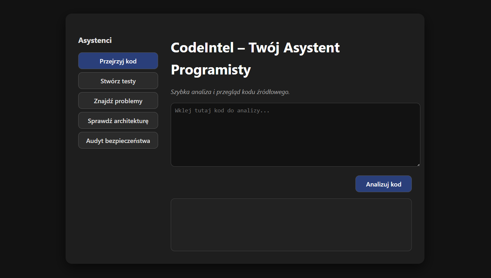
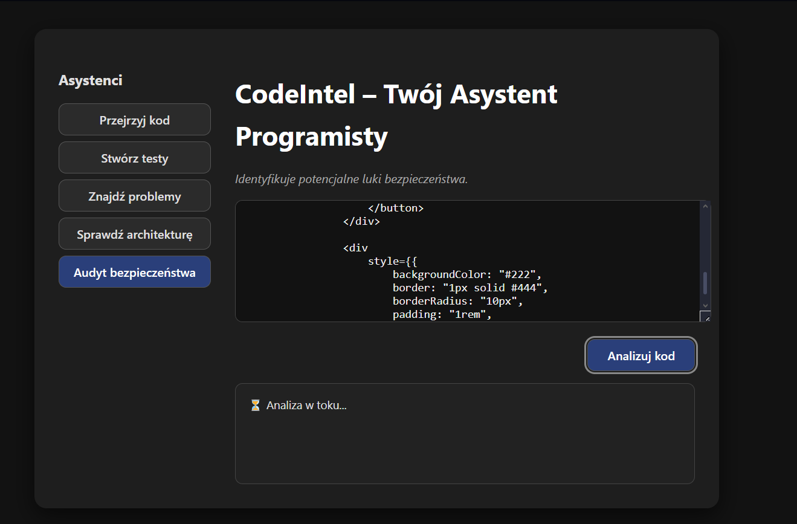
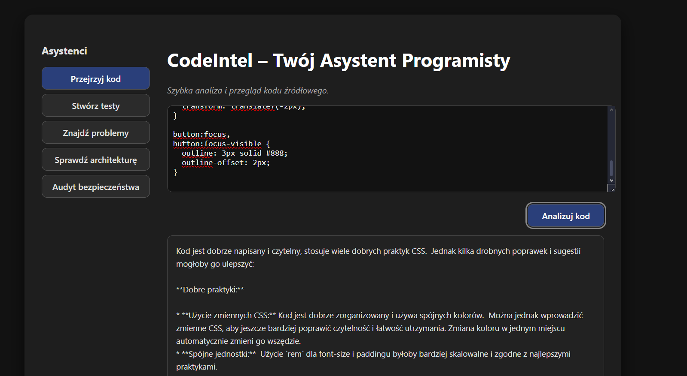
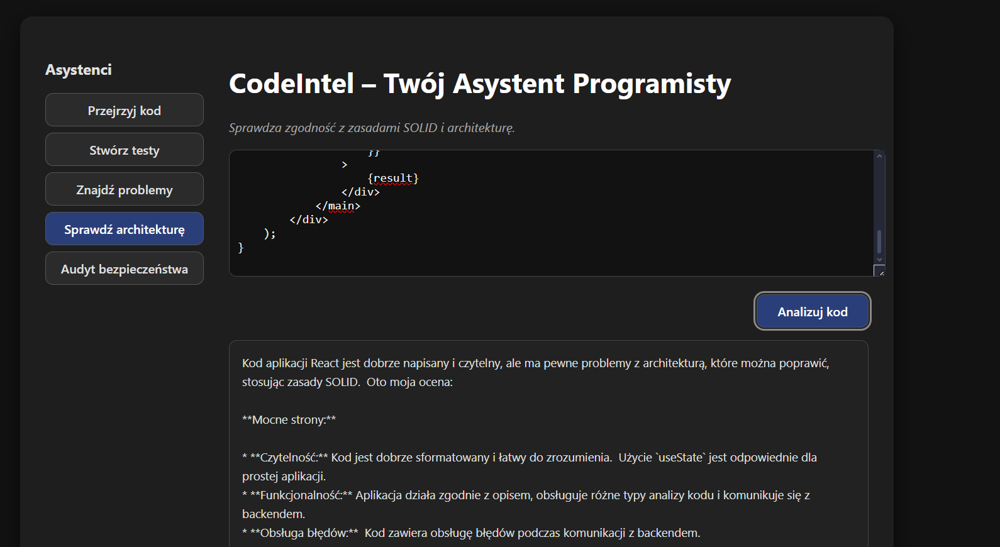
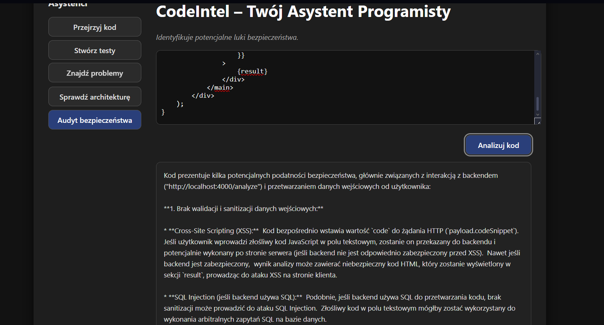

# CodeIntel – Asystent AI dla Programisty

**CodeIntel** to aplikacja webowa stworzona w React z wykorzystaniem sztucznej inteligencji, która wspiera programistów i testerów oprogramowania w analizie kodu źródłowego. Pozwala generować testy jednostkowe, oceniać jakość kodu, wykrywać błędy, analizować zgodność z zasadami SOLID, a także wskazywać potencjalne problemy z bezpieczeństwem.

Dzięki integracji z modelem AI, aplikacja analizuje dostarczony kod w czasie rzeczywistym i zwraca odpowiedź w postaci sugestii, opisów lub wygenerowanych testów. Interfejs użytkownika został zaprojektowany w sposób responsywny i przejrzysty, z bocznym panelem wyboru trybu analizy, edytorem kodu oraz sekcją wyświetlającą wynik.

---

## Funkcjonalności

- **Przejrzyj kod** – szybka analiza i recenzja kodu źródłowego
- **Stwórz testy** – generowanie testów jednostkowych
- **Znajdź problemy** – wykrywanie błędów, nieczytelności i antywzorców
- **Sprawdź architekturę** – ocena zgodności z SOLID i Prawem Demeter
- **Audyt bezpieczeństwa** – analiza potencjalnych luk bezpieczeństwa

---

## Screeny z działania aplikacji

| Ekran początkowy        | Analiza kodu (w trakcie)   |
|-------------------------|----------------------------|
|  |  |

| Wynik: Przejrzyj kod             | Wynik: Sprawdź architekturę     | Wynik: Audyt bezpieczeństwa |
|----------------------------------|---------------------------------|-----------------------------|
|  |  |     |


---

## Autor

Projekt stworzony przez: **[Natalia Maroszek]**  
W ramach: *projektu zaliczeniowego*  
Technologie: React, TypeScript, CSS (custom), Node.js (backend), Gemini/GPT (AI)

---

## Cele projektu

- Zastosowanie AI w analizie kodu i wspomaganiu testów
- Zautomatyzowanie podstawowych zadań QA i code review
- Zbudowanie nowoczesnego i prostego interfejsu użytkownika

---

## Uruchomienie lokalne

1. Zainstaluj zależności:
```bash
npm install
